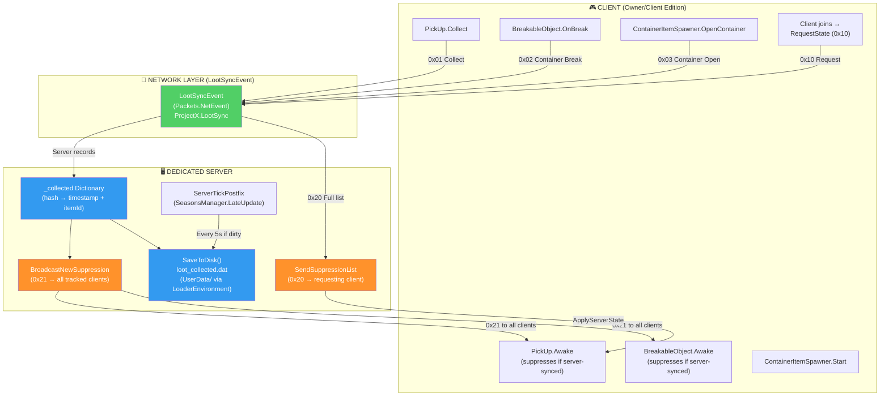
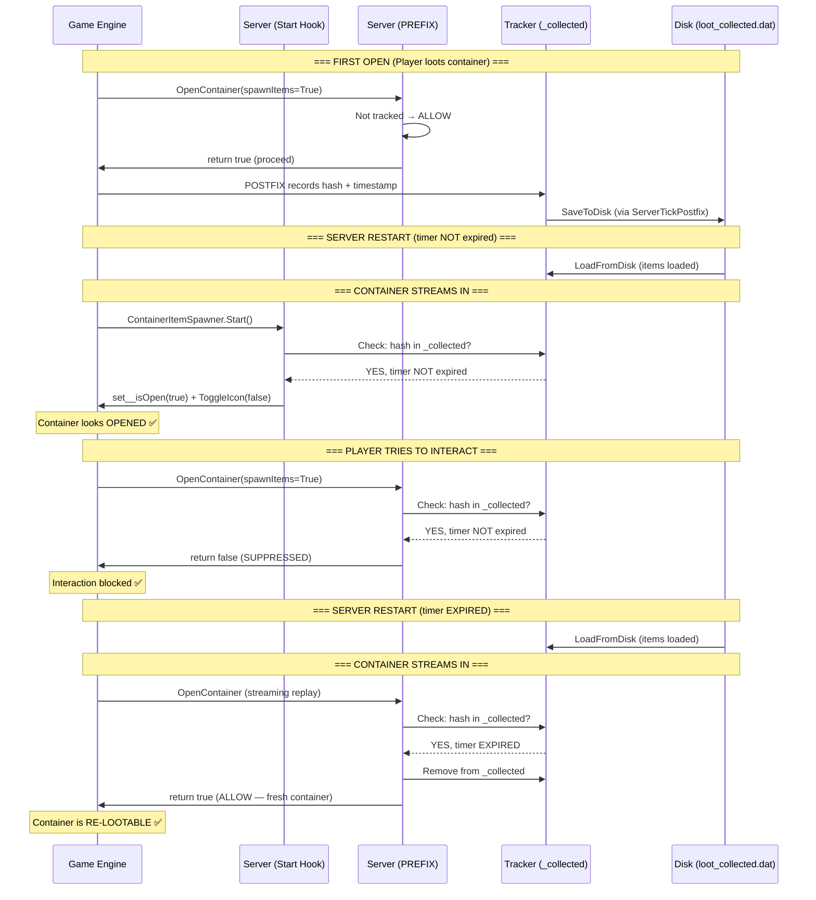
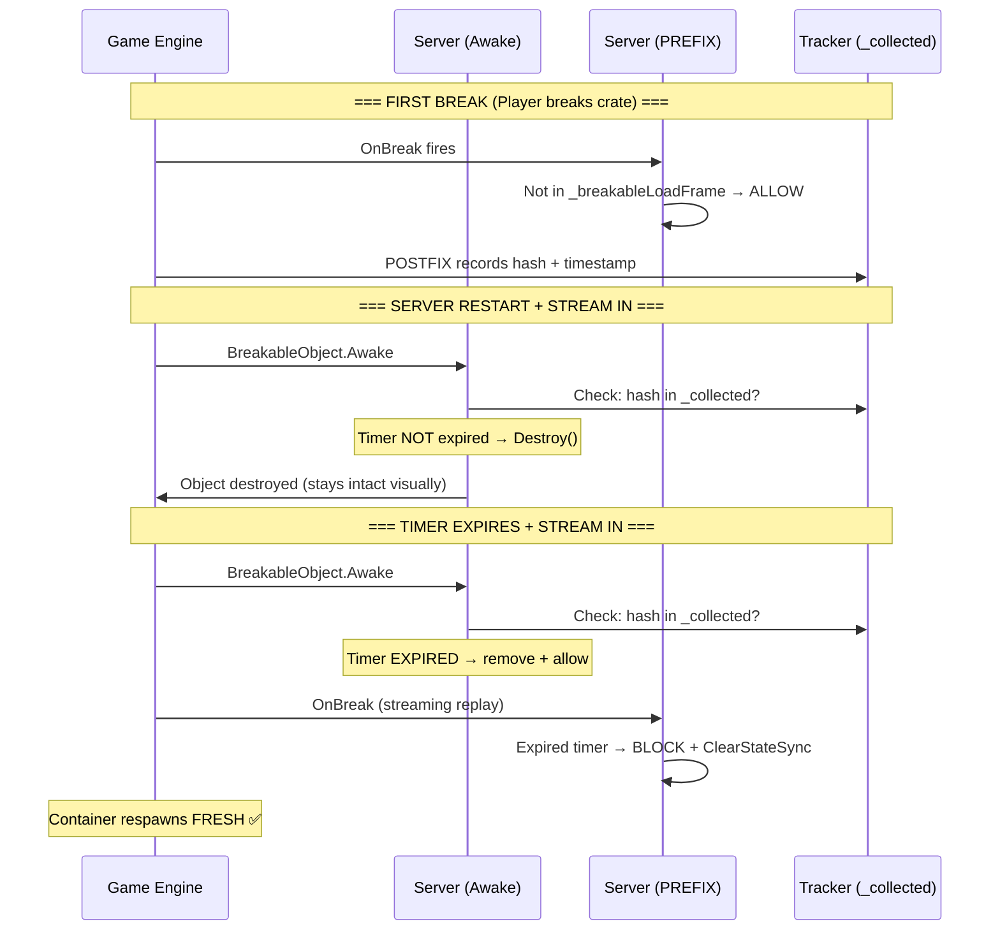
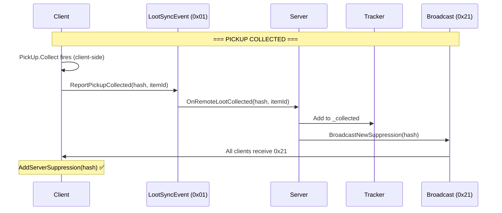
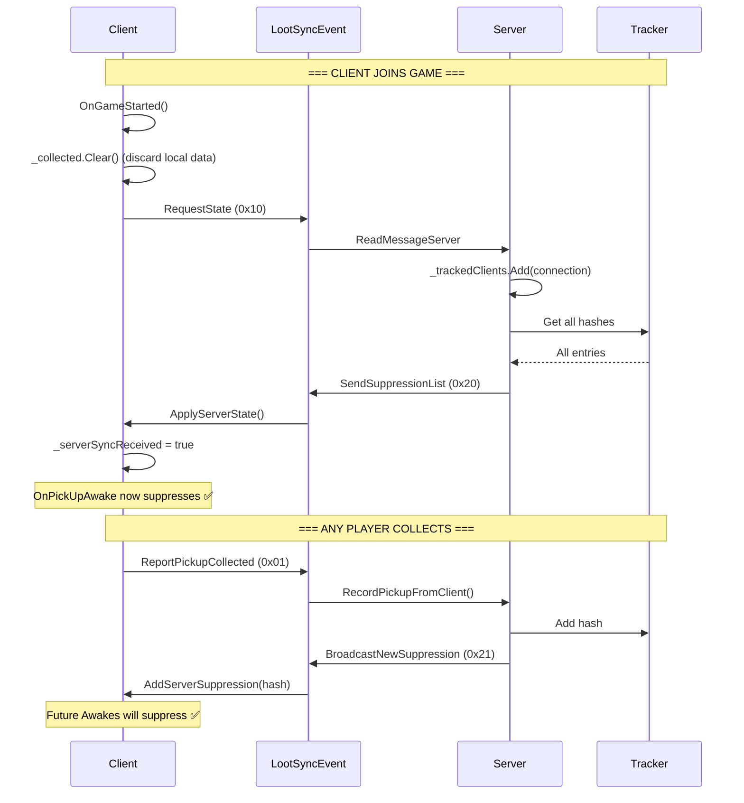

# Loot Respawn Module — Network Architecture

## Overview

## LootSyncEvent Protocol

| Msg    | Direction       | Purpose                            |
| ------ | --------------- | ---------------------------------- |
| `0x01` | Client → Server | Pickup collected (hash + itemId)   |
| `0x02` | Client → Server | Container broken (hash)            |
| `0x03` | Client → Server | Container opened (hash)            |
| `0x10` | Client → Server | Request full suppression list      |
| `0x20` | Server → Client | Full suppression list (all hashes) |
| `0x21` | Server → Client | Incremental suppress (single hash) |

## Per-Loot-Type Flow

### Openable Containers (ammo cases, storage crates)

### Breakable Containers (coffins, crates)

### Ground Pickups (via LootSyncEvent)

## Client Sync Flow

## Key Design Decisions

| Decision | Rationale |
|----------|-----------|
| **Server-authoritative** | All tracking stored on server; clients receive via sync |
| **LootSyncEvent** | Dedicated NetEvent replaces debugCommand for reliability |
| **Incremental broadcast (0x21)** | Avoids full-list resend; one hash per collection event |
| **Timer-expired removal** | Entries removed from `_collected` when timer expires — container becomes truly fresh |
| **_recentlyRespawned streaming-only** | Only blocks during save-load phase; players interact normally after |
| **Dual-layer suppression** | `Start` hook (proactive) + `PREFIX` (reactive) for containers |
| **ServerTickPostfix driver** | `SdkEvents.OnInWorldUpdate` dead on headless (Pattern #19) |
| **LoaderEnvironment path** | `../../UserData` relative to DLL breaks on hosted servers |
| **Client clear on join** | `_collected.Clear()` in `OnGameStarted()` discards stale local data |
